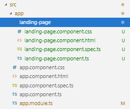

# Lab 01 - Starting a New Angular Project
## Objectives and Outcomes
In this lab we will create a new Angular Project using the angular-cli. Then we will configure the application to use Angular Material. In addition, we will start working with our first Angular Material component to create the navbar application. 
* Create an Angular Project 
* Install Angular Material 
* Using a Material component 

Create a new Angular application named open-events-front
```sh
ng new open-events-front –-style=scss --prefix=oevents
Would you like to add Angular routing? (y/N) N
```
* style: specifies the file extension or preprocessor to use for style files
* prefix:  if added then it will be prefix to apply to generated selectors for the initial project

The first time that the application runs the welcome angular page will show up in our browser. 

<p align="center">
    
</p>

Now we will change this page, for that we will create our first component for a landing page using the Angular CLI. 
```sh
ng generate component landing-page
```

A new folder with the components files will be created under src/app/landing-page.

<p align="center">
    
</p>

The Angular CLI creates all this structure for us. Besides it imports the new component in the app.module.ts file
```javascript
...

import { LandingPageComponent } from './landing-page/landing-page.component';
@NgModule({
  declarations: [
    AppComponent,
    LandingPageComponent
  ],
 ...

```

Delete the content from landing-page.component.html and copy and paste the following code on it.
```javascript
...
<div class="container">
  <div class="title">
    <h1>Open Events App</h1>
  </div>
  <div class="subtitle">
    <h2>All our events</h2>
  </div>
  <div class="message">
    <p>
      A new and fresh application to host all our tech events crafted from
      Accenture Openathons
    </p>
  </div>
</div>
 ...

```


Copy and paste the following code in landing-page.component.scss
```javascript
.container {
  display: flex;
  flex-flow: column;
  text-align: center;
}
.title,
.subtitle,
.message {
  padding: 1rem;
}
.title {
  color: #8bc34a;
}
.subtitle {
}
.message {
}

```

Delete the content from app.component.html and copy and paste the following code on it.


```javascript
<div class="body">
  <oevents-landing-page></oevents-landing-page>
</div>

```

Our new landing page should appear in the browser. 


<p align="center">
    
</p>


To configure our project to use Angular Material, we need to install the following: Angular Material, the Component Dev Kit (CDK), Animations and HammerJS:

```sh
 npm install --save @angular/material@7.3.7 @angular/cdk@7.3.7 @angular/animations@7.2.14 hammerjs@2.0.8
```

Using Material Design Icons.
Edit index.html file and include the following into the <head>
```javascript
...
<head>
...
<link href="https://fonts.googleapis.com/icon?family=Material+Icons" rel="stylesheet">
</head>
...

```

Updating AppModule

We need to import some Angular Materials components into our root module (app.module.ts)
```javascript
...
import { BrowserAnimationsModule } from '@angular/platform-browser/animations';
import { MatToolbarModule } from '@angular/material/toolbar';
import { MatButtonModule } from '@angular/material/button';
import { MatListModule } from '@angular/material/list';
import 'hammerjs';

@NgModule({
 ...
  imports: [
    ...
    BrowserAnimationsModule,
    MatToolbarModule,
    MatButtonModule,
    MatListModule 
  ], 
...

```
Addding the toolbar.
Now let’s add a toolbar in our application. Create a new component named ‘toolbar’
```sh
 ng generate component toolbar
```
This command creates the new component adds the folder ‘toolbar’ and the components files on it. As well imports and adds a declaration in the ‘app.module.ts’ file for the new component created 

Edit toolbar/toolbar.component.html and add the following:
```javascript
<mat-toolbar>
  <a mat-button>Home</a>
  <a mat-button>Events</a>
  <a mat-button>Profile</a>
  <a mat-button>Login</a>
</mat-toolbar>
```
Now edit app/app.component.html and add oevetns-toolbar.
```javascript
<div class="body">
  <oevents-toolbar></oevents-toolbar>
  <oevents-landing-page></oevents-landing-page>
</div>

```

After saving all the changes, we should see our toolbar.

<p align="center">
    
</p>


Adding a theme 
We can use a built-in Material theme in our application. For doing this import the following style into styles.css file:

```javascript
@import '@angular/material/prebuilt-themes/indigo-pink.css';

```

Edit toolbar/toolbar.component.html to apply the primary color:

```javascript
<mat-toolbar color="primary">
...

```

<p align="center">
    
</p>


# Resources
[Angular CLI](https://angular.io/cli)

[Install Angular Material](https://material.angular.io/guide/getting-started)

[Angular Material Toolbar](https://material.angular.io/components/toolbar/overview)


